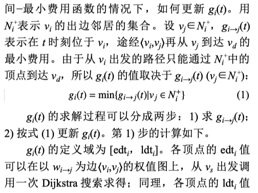
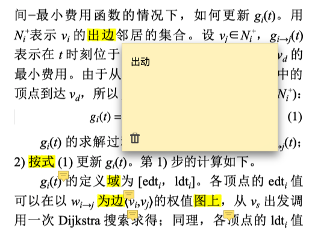

# PDF自动错字检测

## 效果展示
### 原始文本

### 修改文本

## 主要功能
主要功能实现PDF文档中，中文词汇的错词错字自动检测标注
主要功能有：
1. 错字检测
2. 错字标注
3. pdf高亮
## 应用的技术框架
### pdf相关操作
- PyPDF2 pdf拼接等操作
- [pdfminer](https://github.com/pdfminer/pdfminer.six) 读取pdf中文字
- [PyMuPDF](https://pymupdf.readthedocs.io/en/latest/) 对文字进行高亮,提取文字
### 错词错字纠正
- [pycorrector](https://github.com/shibing624/pycorrector)

## 存在缺陷
- 自动识别错词(使用的pycorrector)对文献类的专业词汇pdf存在明显的识别缺陷。
- 对pdf标注错词定位，如两个相同的字出现需要定位文中哪个具体位置。

## TODO
- [ ] 使用新的语料库对计算机文献进行语句训练
- [ ] 解决错词定位的问题
